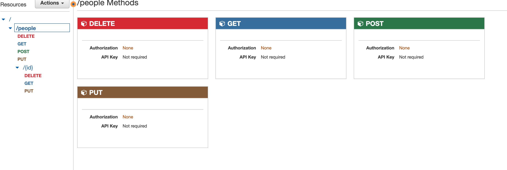

# serverless-api

Author: Ashwini Uppal

## Feature Tasks and Requirements
Create a single resource REST API using a domain model of your choosing, constructed using AWS Cloud Services.

Database: DynamoDB
1 Table required.
Routing: API Gateway
POST
/people - Given a JSON body, inserts a record into the database.
returns an object representing one record, by its id (##).
GET
/people - returns an array of objects representing the records in the database.
/people/## - returns an object representing one record, by its id (##).
PUT
/people/## - Given a JSON body and an ID (##), updates a record in the database.
returns an object representing one record, by its id (##).
DELETE
/people/## - Given an id (##) removes the matching record from the database.
returns an empty object.

## Documentation

### API Routes

#### POST /people

* Creates a new person in the database
* Returns the new person

#### GET /people

* Returns all people in the database

#### GET /people/{id}

* Returns the person with the given id

#### PUT /people/{id}

* Updates the person with the given id

#### DELETE /people/{id}

* Deletes the person with the given id

Deployed API:

https://oe4x5yshth.execute-api.us-west-2.amazonaws.com/lab18/people

## API

